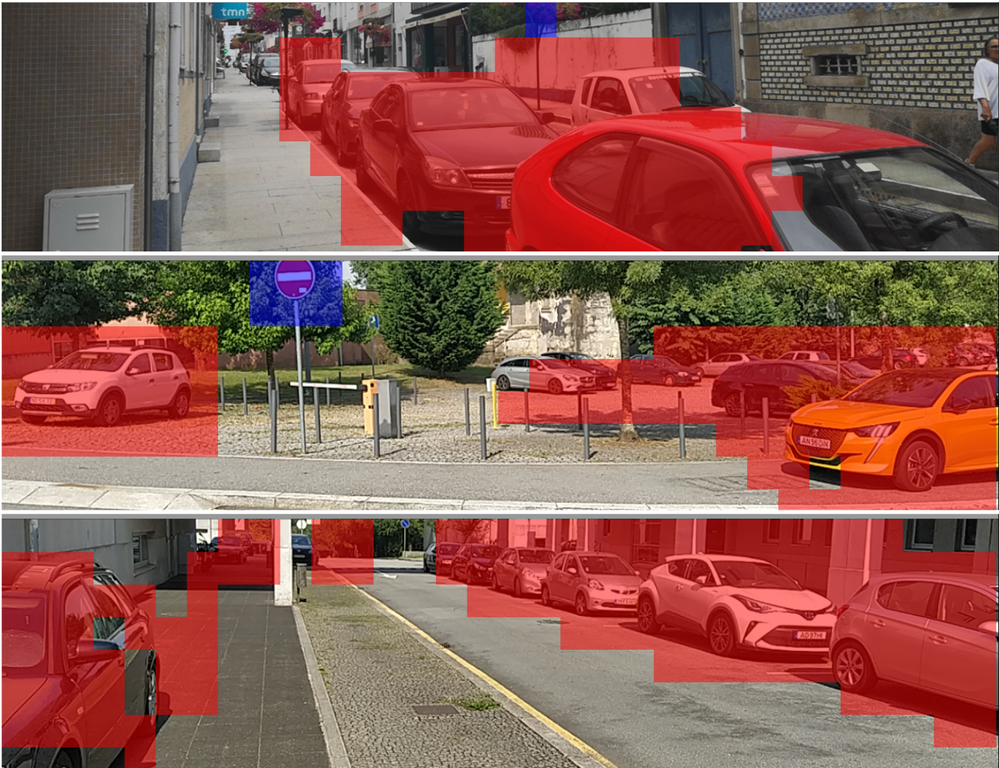

# Mobile Car Driving

Android application that provides driver assistance via computer vision developed using Pytorch (Mobile).

The main challenge involved creating a model that was both performant enough to be capable of running in real time and that was compatible with the limited capabilities of Pytorch Mobile.

It was developed as a capstone project for the Bachelor's degree in Informatics and Computing Engineering at FEUP and later re-structured for public publishing.
The initial version was presented and published @RECPAD 2022, and a short paper can be found [here](http://mobilecardriving.papers.filipepcampos.com/).
